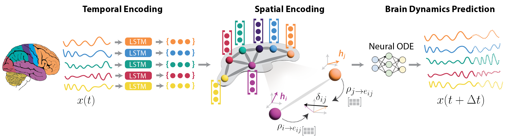

# BrainDyn

**BrainDyn** is a neural ODE framework for modelling brain dynamics on graphs. It combines a sheaf-theoretic graph Laplacian with an LSTM temporal encoder and a continuous-time ODE integrator to forecast multi-channel neural signals (fMRI, EEG) and support downstream tasks such as seizure classification.

---



---

## Overview

The core model (`BrainDyn`) operates in two stages:

1. **Temporal encoding** — an LSTM processes each node's recent signal window to produce a hidden state $h_t \in \mathbb{R}^{N \times D}$.
2. **Graph diffusion via sheaf Laplacian** — learned restriction maps define per-edge linear maps; the resulting sheaf Laplacian $L_\mathcal{F}$ diffuses information across the graph.
3. **ODE integration** — a neural vector field $f_\theta(x_t, L_\mathcal{F} h_t)$ defines $\dot{x} = f_\theta$, which is integrated forward with `torchdiffeq` (default: RK4).

An optional GAT aggregator (`--use_gat`) can replace the sheaf Laplacian as an ablation baseline.

### Datasets

| Dataset | Description |
|---------|-------------|
| **PNC fMRI** | Philadelphia Neurodevelopmental Cohort resting-state fMRI; short (30 s context → 10 s forecast) and long forecast variants |
| **TUSZ EEG** | Temple University Hospital EEG Seizure Corpus; 19-channel scalp EEG at 200 Hz resampled to HDF5; binary seizure classification via two-stage training |
| **NEST (simulated)** | Synthetic multi-neuron spiking dataset from `.npz`; used for controlled connectivity-inference experiments |

---

## Installation

Requires Python ≥ 3.11.

**Recommended (uv):**
```bash
uv venv
source .venv/bin/activate
uv sync
```

**Alternative (pip):**
```bash
python -m venv .venv
source .venv/bin/activate
pip install -e .
```

---

## Data

Place all data files under `data/`. See [`data/data.md`](data/data.md) for the full TUSZ HDF5 layout specification.

| Path | Contents |
|------|----------|
| `data/tusz_binary.h5` | Pre-windowed TUSZ EEG dataset |
| `data/manifest_tusz_binary.csv` | Window manifest with seizure labels |
| `data/simulated_neuron_dataset/dataset.npz` | NEST synthetic neuron dataset |

---

## Experiments

All experiments are launched via Slurm scripts in `scripts/`. Run from the repo root:

### PNC fMRI — main forecast (short horizon)
```bash
sbatch scripts/train_short_main.sh
# optional: COHORT=PNC sbatch scripts/train_short_main.sh
```

### PNC fMRI — long horizon forecast
```bash
sbatch scripts/train_long_main.sh
```

### PNC fMRI — ablations
```bash
sbatch scripts/train_short_ablation_no_lstm.sh   # replace LSTM encoder with linear projection
sbatch scripts/train_short_ablation_gat.sh        # replace sheaf Laplacian with GAT
sbatch scripts/train_long_ablation_no_lstm.sh
sbatch scripts/train_long_ablation_gat.sh
```

### TUSZ binary seizure classification
Two-stage: forecast pre-training → frozen backbone + classification head fine-tuning.
```bash
sbatch scripts/train_tusz_binary.sh
# ablations:
sbatch scripts/train_tusz_binary_ablation_no_lstm.sh
sbatch scripts/train_tusz_binary_ablation_gat.sh
```

Key environment variables for TUSZ:

| Variable | Default | Description |
|----------|---------|-------------|
| `H5_PATH` | `data/tusz_binary.h5` | Path to HDF5 dataset |
| `MANIFEST_CSV` | `data/manifest_tusz_binary.csv` | Window manifest |
| `EPOCHS_FORECAST` | `100` | Forecast pre-training epochs |
| `EPOCHS_CLS` | `50` | Classification fine-tuning epochs |
| `CV_FOLDS` | `5` | Number of cross-validation folds |
| `BATCH_SIZE` | `64` | Batch size |

### NEST simulated neuron dataset
```bash
sbatch scripts/train_nest.sh
# optional: NPZ_PATH=data/simulated_neuron_dataset/dataset.npz sbatch scripts/train_nest.sh
```

---

## Visualization

| Script | Description |
|--------|-------------|
| `visualize_val_dynamics.py` | Validation trajectory plots (PNC fMRI) |
| `visualize_val_dynamics_tusz.py` | Validation trajectory plots (TUSZ) |
| `visualize_val_dynamics_nest.py` | Validation trajectory plots (NEST) |
| `visualize_test_dynamics.py` | Test-set dynamics |
| `visualize_attention_interpretation.py` | Sheaf/attention weight interpretation |
| `visualize_nest_connectivity_inference.py` | Inferred connectivity on NEST |
| `eval_odebrain_sn_graph.py` | Graph-level ODE evaluation |

---

## Model configuration

`BrainDynConfig` controls all architecture hyperparameters:

| Parameter | Description |
|-----------|-------------|
| `signal_dim` | Input signal dimensionality per node |
| `hidden_dim` | LSTM / sheaf hidden size |
| `num_nodes` | Number of graph nodes (channels) |
| `window_size` | Context window length (time steps) |
| `lstm_layers` | Number of LSTM layers |
| `map_hidden_dim` | Sheaf restriction map bottleneck dimension |
| `vf_hidden_dim` | Vector field MLP hidden size |
| `ode_method` | ODE solver: `rk4`, `dopri5`, `euler`, `midpoint` |
| `use_gat` | Use GAT aggregator instead of sheaf Laplacian |
| `use_lstm_encoder` | Use LSTM encoder (disable for no-LSTM ablation) |

---

## Checkpoints

Pre-trained checkpoints are stored in `checkpoints/`. Naming convention:

```
braindyn_<dataset>_<variant>_best[_fold<k>].pt
```

Examples: `braindyn_rbc_pnc_short_main_best_fold1.pt`, `braindyn_tusz_binary_forecast_best.pt`, `braindyn_nest_unperturbed_best_fold1.pt`.

---

## Project structure

```
BrainDyn/
├── main.py                        # PNC fMRI training entrypoint
├── train_tusz_binary.py           # TUSZ binary classification entrypoint
├── train_nest.py                  # NEST dataset entrypoint
├── model/
│   ├── braindyn.py                # Top-level model (ODE integrator)
│   ├── dynamics.py                # dx/dt vector field
│   ├── sheaf.py                   # Sheaf Laplacian & GAT aggregator
│   ├── temporal_encoder.py        # LSTM history encoder
│   ├── attention.py               # Attention utilities
│   ├── losses.py                  # MSE, MAE, DTW, PCC, SCC losses
│   └── odefunc.py                 # ODE function wrapper
├── data/
│   └── data.md                    # TUSZ HDF5 dataset specification
├── scripts/                       # Slurm job submission scripts
├── checkpoints/                   # Saved model weights
├── notebooks/                     # Analysis notebooks
└── logs/slurm/                    # Slurm stdout/stderr logs
```
